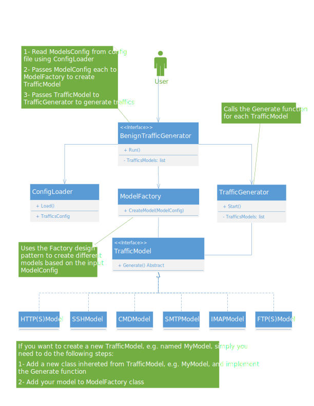

# Benign User Profiler (BUP)

BUP is a tool for generating benign user traffic patterns for security research and testing. It simulates realistic user behavior across various protocols and applications.

# Table of Contents

- [Features](#features)
- [Installation](#installation)
- [Usage](#usage)
- [Architecture](#architecture)
- [Traffic Models](#traffic-models)
- [Citation and Copyright 2024](#citation-and-copyright-2024)
- [Project Team members](#project-team-members)
- [Acknowledgement](#acknowledgement)

# Features

- **Multi-protocol support**: HTTP/HTTPS, SSH, FTP/SFTP, SMTP, IMAP, and command-line operations
- **No browser dependencies**: Lightweight HTTP simulation using requests and BeautifulSoup
- **YouTube support**: Simulate visiting YouTube, searching for videos, and watching content
- **Media download simulation**: Download images from various sources
- **Cloud storage integration**: Simulate Google Drive and OneDrive usage
- **Email capabilities**: Send and receive emails via Gmail, Outlook, and other providers
- **Application launching**: Open and interact with applications on Windows and Linux
- **Scheduling**: Configure frequency and timing of activities with work hours restrictions
- **Cross-platform**: Works on Linux and Windows

# Installation

You must install the requirements in your system before you can begin installing or running anything. To do so, you can easily run this command:

```bash
pip3 install -r requirements.txt
```

You are now ready to install BenignUserProfiler. In order to do so, you should run this command, which will install the BenignUserProfiler package in your system:

```bash
python3 setup.py install
```

# Usage

To execute the program, run this command:

```bash
benign-user-profiler
```

Also, you can use `-h` to see different options of the program:

```bash
# Run with default config file
benign-user-profiler

# Run with a specific config file
benign-user-profiler --config /path/to/config.json

# Run with parallel execution
benign-user-profiler --parallel

# Run with work hours restrictions (9am-5pm by default)
benign-user-profiler --work-hours

# Run with custom work hours
benign-user-profiler --work-hours "10:00-18:00"

# Run with randomized task execution
benign-user-profiler --randomize
```

## Configuration

The tool is configured via a JSON file (`config.json`). Here's a sample configuration:

```json
{
  "web_browsing": {
    "type": "HTTP",
    "randomize": true,
    "websites": [
      "https://www.wikipedia.org",
      "https://www.github.com",
      "https://www.reddit.com"
    ],
    "visit_sublinks": {
      "enabled": true,
      "depth": 2,
      "max_links": 4
    },
    "frequency": 2,
    "time_interval": [600, 1200],
    "start_time": "09:00",
    "start_time_format": "%H:%M",
    "work_hours": {
      "start": "09:00",
      "end": "17:00"
    }
  },
  "youtube_browsing": {
    "type": "HTTP",
    "website": "youtube",
    "youtube_searches": ["python programming", "cloud computing", "machine learning"],
    "youtube_min_watch": 10,
    "youtube_max_watch": 60,
    "frequency": 1,
    "time_interval": [1200, 3600],
    "start_time": "10:30",
    "start_time_format": "%H:%M"
  }
}
```

See `config.json` for a complete example with all supported protocols.

This project has been successfully tested on Ubuntu 22.04. It should work on other versions of Ubuntu OS (or even Debian OS) as long as your system has the necessary python3 packages (you can see the required packages in the `requirements.txt` file).

# Architecture



# Traffic Models

BUP supports the following traffic models:

## HTTP/HTTPS
- Web browsing using requests and BeautifulSoup (no browser dependencies)
- Multi-site navigation
- YouTube integration for simulated video watching
- Media downloading from various sources
- Cloud storage interaction (Google Drive, OneDrive)
- Configurable sublink navigation with depth control
- Work hours restrictions for realistic usage patterns

## Email
- SMTP for sending emails
- IMAP for receiving emails
- Support for Gmail, Outlook, and other providers
- Attachment handling

## Command Line
- Execute system commands
- Platform-specific command execution (Windows/Linux)
- Launch applications
- Simple application interactions

## SSH
- Connect to remote servers
- Execute commands
- Authentication with username/password

## FTP/SFTP
- File transfers
- Directory listing
- File uploading/downloading

# Citation and Copyright 2024

For citation in your works and also to understand BUP completely, you can find below the published paper:

"Toward Generating a New Cloud-Based Distributed Denial of Service (DDoS) Dataset and Cloud Intrusion Traffic Characterization", Shafi, MohammadMoein, Arash Habibi Lashkari, Vicente Rodriguez, and Ron Nevo.; Information 15, no. 4: 195. https://doi.org/10.3390/info15040195

```
@Article{info15040195,
AUTHOR = {Shafi, MohammadMoein and Lashkari, Arash Habibi and Rodriguez, Vicente and Nevo, Ron},
TITLE = {Toward Generating a New Cloud-Based Distributed Denial of Service (DDoS) Dataset and Cloud Intrusion Traffic Characterization},
JOURNAL = {Information},
VOLUME = {15},
YEAR = {2024},
NUMBER = {4},
ARTICLE-NUMBER = {195},
URL = {https://www.mdpi.com/2078-2489/15/4/195},
ISSN = {2078-2489},
DOI = {10.3390/info15040195}
}
```

# Project Team Members

* [**Arash Habibi Lashkari:**](http://ahlashkari.com/index.asp) Founder and supervisor

* [**Moein Shafi:**](https://github.com/moein-shafi) Graduate researcher and developer - York University

# Acknowledgement
This project has been made possible through funding from the Natural Sciences and Engineering Research Council of Canada — NSERC (#RGPIN-2020-04701) and Canada Research Chair (Tier II) - (#CRC-2021-00340) to Arash Habibi Lashkari.